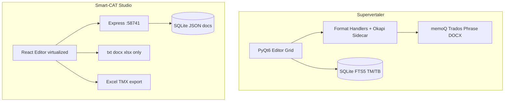
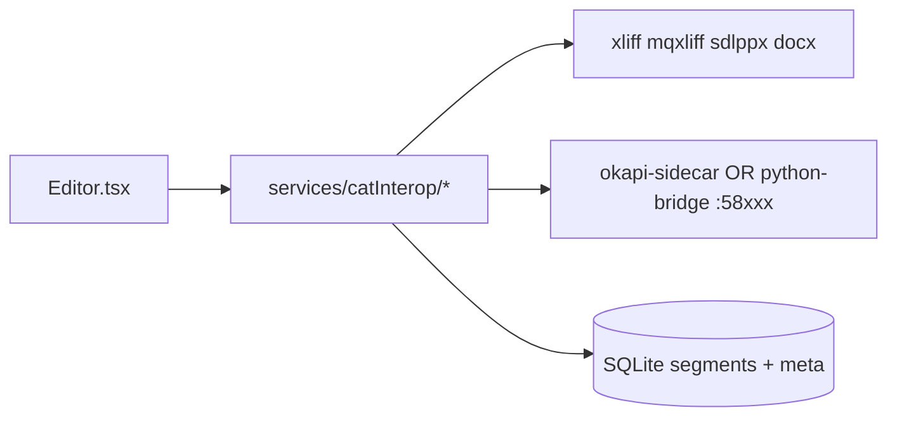

# Supervertaler vs Smart-CAT Studio 借鉴分析

## 一、两款应用定位对比

| 维度 | Supervertaler（中文版） | Smart-CAT Studio v1.7.7.6 |
|------|-------------------------|---------------------------|
| 形态 | PyQt6 **原生桌面**（单文件 `Supervertaler.py` ~63k 行 + `modules/`） | **浏览器 SPA** + Node/SQLite 本地服务（`App.tsx` + `pages/Editor.tsx`） |
| 数据 | `~/Supervertaler/supervertaler.db`（SQLite + **FTS5**）+ `.svproj` JSON 项目 | 单 SQLite 文件（`server/index.mjs`）+ JSON `documents` 集合 |
| 强项 | **商业 CAT 往返**、Okapi、多 MT/LLM、全局查词、语音 | **孪生译员**、语法/正则规则、知识库 RAG、重复分析、中文工作流 |
| 版本 | 1.10.88 | 1.7.7.6 |

**结论**：两者都是「本地优先、段级编辑、TM/TB/AI」的 CAT 工作台，但 Supervertaler 的核心壁垒在 **格式处理器 + Okapi 侧车 + 段元数据保真**；Smart-CAT 的核心壁垒在 **规则引擎 + 个性化 AI（孪生/知识库）**。您选「商业 CAT 往返」时，格式层差距是首要补齐项。

---

## 二、功能对照：您已具备 vs 明显缺口

### Smart-CAT 已具备（不必照搬，可对照打磨）

- 段级编辑、TM 匹配（Ctrl+1–9）、术语高亮、确认写回 TM（[`pages/Editor.tsx`](d:\BaiduSyncdisk\PY-Project\自制工具软件\smart-cat-studio-v1.7.7.6\pages\Editor.tsx)）
- 批量预翻译（AI 分析上下文 + 并发翻译，约 3120 行起）
- 在线词典面板（Ctrl+D，[`pages/OnlineDictionary.tsx`](d:\BaiduSyncdisk\PY-Project\自制工具软件\smart-cat-studio-v1.7.7.6\pages\OnlineDictionary.tsx)）
- TMX **导出**（[`App.tsx`](d:\BaiduSyncdisk\PY-Project\自制工具软件\smart-cat-studio-v1.7.7.6\App.tsx) `handleExportFile`）
- 孪生译员、语法规则书、正则词典、知识库 RAG — Supervertaler 无对等深度

### 与 Supervertaler 差距最大（与您场景直接相关）

| 能力 | Supervertaler 实现参考 | Smart-CAT 现状 |
|------|------------------------|----------------|
| **MQXLIFF / SDLXLIFF 往返** | [`modules/mqxliff_handler.py`](D:\BaiduSyncdisk\PY-Project\自制工具软件\Supervertaler-Workbench-main-中文版\modules\mqxliff_handler.py)、[`sdlppx_handler.py`](D:\BaiduSyncdisk\PY-Project\自制工具软件\Supervertaler-Workbench-main-中文版\modules\sdlppx_handler.py) | 无 XLIFF 导入；段模型无 `sdl_segment_id` 等 round-trip 字段（[`types.ts`](d:\BaiduSyncdisk\PY-Project\自制工具软件\smart-cat-studio-v1.7.7.6\types.ts)） |
| **Okapi 提取/合并** | [`modules/okapi_sidecar.py`](D:\BaiduSyncdisk\PY-Project\自制工具软件\Supervertaler-Workbench-main-中文版\modules\okapi_sidecar.py)（Java JAR + localhost REST） | 仅 mammoth/xlsx 粗分段 |
| **双语 DOCX（memoQ/Trados）** | `memoqrtf_handler.py`、`trados_docx_handler.py` | 仅整文 docx 按行切分 |
| **TMX 导入** | TM 管理 UI + TMX 编辑器 | 仅导出 TMX |
| **段状态机（校对/批准）** | [`modules/statuses.py`](D:\BaiduSyncdisk\PY-Project\自制工具软件\Supervertaler-Workbench-main-中文版\modules\statuses.py) | `NotStarted`…`Review`，无 proofread/approved/rejected |
| **格式标签（inline tags）** | 网格内 TagHighlighter、Ctrl+, 插标签 | 无结构化标签模型 |
| **结构化批注** | `Comment` + anchor（v1.10.57） | 段级 notes 较弱 |
| **预翻译策略** | TM / MT / LLM 可选（`PreTranslationWorker`） | 批量预翻译偏 **纯 LLM**（[`Editor.tsx`](d:\BaiduSyncdisk\PY-Project\自制工具软件\smart-cat-studio-v1.7.7.6\pages\Editor.tsx)） |
| **校对流水线** | `ProofreadWorker` + 模型批注 | 有 QA 检查，无独立校对批处理 |

### 效率类差距（次要但值得借鉴）

- **Superlookup / QuickTrans**：全局 Ctrl+Alt+L / Ctrl+Alt+Q，聚合 TM+术语+MT+网页（[`modules/superlookup.py`](D:\BaiduSyncdisk\PY-Project\自制工具软件\Supervertaler-Workbench-main-中文版\modules\superlookup.py)）— 浏览器 SPA **无法直接**注册系统热键，需 Electron/Tauri 或独立 AHK/小助手进程
- **多 MT 引擎**：Google / DeepL / Amazon（[`translation_services.py`](D:\BaiduSyncdisk\PY-Project\自制工具软件\Supervertaler-Workbench-main-中文版\modules\translation_services.py)）— Smart-CAT 以 Gemini/DeepSeek 为主
- **导航预取缓存**：切换句段时 TM/MT 结果已缓存（memoQ 式即时匹配面板）
- **语音听写**：Vosk + faster-whisper（[`voice_tab.py`](D:\BaiduSyncdisk\PY-Project\自制工具软件\Supervertaler-Workbench-main-中文版\modules\voice_tab.py)）
- **统一提示词库**：双层 system/custom（[`unified_prompt_manager_qt.py`](D:\BaiduSyncdisk\PY-Project\自制工具软件\Supervertaler-Workbench-main-中文版\modules\unified_prompt_manager_qt.py)）— Smart-CAT 有 `quickPrompts` 但分散在设置里

---

## 三、架构借鉴：不要复制单体，要复制「边界」

Supervertaler 把 UI 堆在 `Supervertaler.py`，但 **可复用的设计** 是：

1. **Segment 是 round-trip 载体**：除 source/target 外，保留 `okapi_tu_id`、`sdl_segment_id`、`mqxliff` 元数据等（见 Supervertaler `Segment` dataclass ~1354 行）
2. **格式适配器独立**：每个 CAT 一个 `*_handler.py`，主程序只 orchestrate
3. **Okapi 作为侧车**：重活交给 Java，Python/Node 只调 REST — **与当前 Smart-CAT 的 embedding-server 模式一致**，可复用同一思路
4. **TM 用 FTS5**：大库模糊匹配性能优于「全量 JSON 载入内存」（Smart-CAT 的 TM 存在 `documents` JSON 里，项目变大后会成为瓶颈）

对 Smart-CAT 的推荐分层（保持 React 前端不变）：

---

## 四、分阶段借鉴路线（均衡 + 偏重 CAT 往返）

### 阶段 A — 数据模型与最小往返（4–6 周，最高 ROI）

**目标**：能导入/导出一种主流格式且不丢 ID。

1. **扩展 `Segment` / 导入导出管道**（[`types.ts`](d:\BaiduSyncdisk\PY-Project\自制工具软件\smart-cat-studio-v1.7.7.6\types.ts)）
   - 增加可选字段：`externalIds: { xliff?: string; sdl?: string; mq?: string; okapiTu?: string }`
   - 增加 `inlineTags` 或保留原始 markup 字符串（先存不编，再编 UI）
   - 扩展 `SegmentStatus`：对齐 Supervertaler 的 pretranslated / proofread / approved（映射到现有 UI 颜色即可）

2. **首选格式：SDLXLIFF 或 MQXLIFF 二选一**
   - 研读并移植逻辑思路（不必逐行抄 Python）：Supervertaler 的 `mqxliff_handler.py` / SDL ID 写回逻辑
   - 在 Node 侧新建 [`services/catInterop/`](d:\BaiduSyncdisk\PY-Project\自制工具软件\smart-cat-studio-v1.7.7.6\services\)（建议 `xliffParser.ts`、`mqxliffExport.ts`），或 **Python 微服务**（与现有 `scripts/embedding-server` 并列）专门做 XML 解析 — XLIFF 命名空间复杂时 Python `lxml` 更稳

3. **Dashboard 导入入口**
   - 在 [`pages/Dashboard.tsx`](d:\BaiduSyncdisk\PY-Project\自制工具软件\smart-cat-studio-v1.7.7.6\pages\Dashboard.tsx) 增加「CAT 包 / XLIFF」导入，与现有 txt/docx/xlsx 并列
   - 导出时写回同一文件结构（round-trip 验收标准：Trados/memoQ 重新打开无丢段、标签不乱）

4. **TMX 导入**（并行小任务）
   - 参考 Supervertaler TM 管理；在 [`pages/Resources.tsx`](d:\BaiduSyncdisk\PY-Project\自制工具软件\smart-cat-studio-v1.7.7.6\pages\Resources.tsx) 增加 TMX → TM units

### 阶段 B — Okapi 侧车 + 更多格式（6–8 周）

**目标**：IDML、HTML、复杂 DOCX 等走行业标准管线。

1. **复刻 Okapi sidecar 模式**（对照 [`okapi_sidecar.py`](D:\BaiduSyncdisk\PY-Project\自制工具软件\Supervertaler-Workbench-main-中文版\modules\okapi_sidecar.py)）
   - 启动脚本检测 Java、下载/定位 JAR、健康检查 `GET /health`
   - Smart-CAT 后端 [`server/index.mjs`](d:\BaiduSyncdisk\PY-Project\自制工具软件\smart-cat-studio-v1.7.7.6\server\index.mjs) 代理 extract/merge，前端只调 `/api/okapi/*`
   - 合并时把 `okapiTuId` 写回段

2. **双语 DOCX 处理器**（次优先）
   - 参考 `trados_docx_handler.py` / `memoqrtf_handler.py`：按句段对解析，而非 mammoth 纯文本

### 阶段 C — 预翻译 / 校对 / 匹配体验（4 周）

1. **预翻译对话框升级**（[`Editor.tsx`](d:\BaiduSyncdisk\PY-Project\自制工具软件\smart-cat-studio-v1.7.7.6\pages\Editor.tsx) 批量逻辑）
   - 策略：**TM 100% → TM 模糊阈值 → MT（若接入）→ LLM**
   - 与 Supervertaler `PreTranslationWorker` 对齐；保留现有 AI 智能 prompt 作为 LLM 分支

2. **校对批处理**
   - 新建 `services/proofreadService.ts`：后台队列 + 每段 LLM 校对意见写入 `segment.comments[]`

3. **匹配预取**
   - 切换当前句段时，Web Worker 预计算下 N 句的 TM 匹配（避免 UI 卡顿）；对照 Supervertaler 的 idle prefetch 队列

### 阶段 D — 效率与桌面化（可选，依赖产品形态）

| 功能 | 借鉴点 | Smart-CAT 落地注意 |
|------|--------|-------------------|
| 全局 Superlookup | `superlookup.py` | 需 **Electron/Tauri 包装** 或独立 Windows 托盘助手；纯浏览器无法实现 |
| 多 MT | `translation_services.py` | 在 Settings 增加 DeepL/Google API；预翻译/查词面板调用 |
| 语音听写 | `voice_dictation.py` | 浏览器 Web Speech API 或本地 Whisper 服务 |
| 提示词库 | `unified_prompt_manager_qt.py` | 合并 `quickPrompts` 为可分类库，编辑器/AI 面板共用 |
| 主题/快捷键 | `theme_manager.py`、`shortcut_manager.py` | 低成本：CSS 变量主题 + 设置页快捷键表 |

**不建议现阶段照搬**：Supervertaler 63k 行单文件 UI 结构、tkinter 遗留模块、全量中文 `apply_zh_ui.py` 替换方案（您已是中文优先源码）。

---

## 五、应保留的 Smart-CAT 差异化（避免「抄成另一个 Supervertaler」）

继续 invest，而非削弱：

- **孪生译员**（[`twinTranslatorService.ts`](d:\BaiduSyncdisk\PY-Project\自制工具软件\smart-cat-studio-v1.7.7.6\services\twinTranslatorService.ts)）— 个性化译法学习
- **语法/正则规则书** — 可接在阶段 C 的「TM 之后、LLM 之前」规则层
- **知识库 RAG** — 与 Supervertaler 文档分析互补；导出 CAT 时作为项目 `contextDescription` 元数据即可
- **重复分析 / 虚拟列表** — 大项目体验可优于 Supervertaler 单体网格

---

## 六、技术风险与决策点

1. **XLIFF 解析放 Node 还是 Python？**
   - 建议：**首版 Python 微服务**（与 embedding-server 同目录），Node 只做代理；待稳定后可逐步 TS 化热路径
2. **段+标签 UI**：先「原文/译文显示占位符 + 导出保真」，再做强编辑器（工作量大，放在 A 之后）
3. **全局热键**：若近期不桌面化，可用 **系统剪贴板轮询 + 托盘助手** 折中，或暂缓
4. **TM 规模**：长期应将 TM 从 JSON document 迁到 **FTS5 表**（借鉴 [`database_manager.py`](D:\BaiduSyncdisk\PY-Project\自制工具软件\Supervertaler-Workbench-main-中文版\modules\database_manager.py)），否则 CAT 往返项目变大后性能倒挂

---

## 七、建议的验收标准（阶段 A 完成即有价值）

- 从 Trados 或 memoQ 导出的一份 XLIFF/MQXLIFF，在 Smart-CAT 中编辑 20 段并改状态后，导回源工具 **段数一致、ID 一致、标签未破坏**
- TMX 导入 1 万条后，编辑器 TM 匹配响应 &lt; 200ms（为阶段 C 预取打基础）
- 预翻译可选「仅 TM」完成 80% 句段，无需调用 LLM

---

## 八、推荐阅读的 Supervertaler 源文件（按优先级）

1. [`modules/mqxliff_handler.py`](D:\BaiduSyncdisk\PY-Project\自制工具软件\Supervertaler-Workbench-main-中文版\modules\mqxliff_handler.py) — XLIFF 往返
2. [`modules/okapi_sidecar.py`](D:\BaiduSyncdisk\PY-Project\自制工具软件\Supervertaler-Workbench-main-中文版\modules\okapi_sidecar.py) — 侧车生命周期
3. [`Supervertaler.py`](D:\BaiduSyncdisk\PY-Project\自制工具软件\Supervertaler-Workbench-main-中文版\Supervertaler.py) 中 `Segment` / `Project` dataclass — 元数据字段清单
4. [`modules/translation_memory.py`](D:\BaiduSyncdisk\PY-Project\自制工具软件\Supervertaler-Workbench-main-中文版\modules\translation_memory.py) + [`database_manager.py`](D:\BaiduSyncdisk\PY-Project\自制工具软件\Supervertaler-Workbench-main-中文版\modules\database_manager.py) — FTS5 匹配
5. [`modules/superlookup.py`](D:\BaiduSyncdisk\PY-Project\自制工具软件\Supervertaler-Workbench-main-中文版\modules\superlookup.py) — 聚合查词 UX（阶段 D）

若您确认本计划，后续实施可从 **阶段 A：扩展 Segment 模型 + 单一 XLIFF 格式 POC** 开始。
